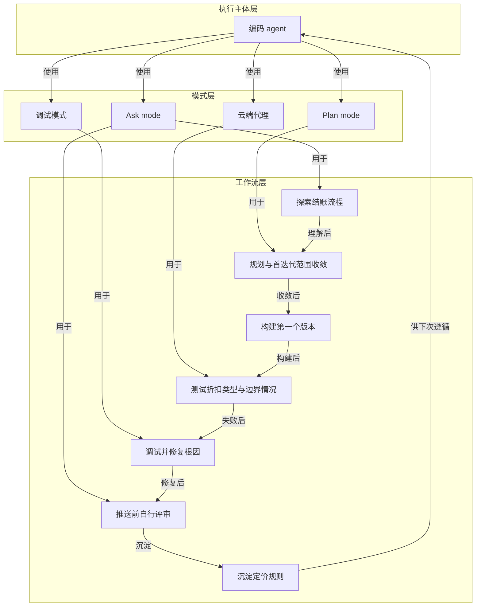

# 完整闭环

> 探索—规划—构建—测试—调试—评审—沉淀组成的编码智能体完整工作闭环。

**领域** loop-autonomy ｜ **类型** PROCEDURAL ｜ **什么时候学** 现在先懂 ｜ **怎么算会了** 能用 ｜ **中心度** 0.144

## 费曼一下

这是全文的主框架：把编码 agent 的不同能力串成一个有顺序的闭环。先探索结账流程，再在 Plan mode 制定并收敛方案，然后构建第一个版本，测试失败后调试根因，推送前用 Ask mode 自我评审，可用云端代理补边界情况，最后把定价规则记录下来供下次使用。它回答的是“如何把前面学到的能力组合起来做一件事”。去掉它，各模式就只是零散工具。

## 二、概念架构图

## 原文 context

这是一个很现实的场景。构建前需要先探索，编写代码前需要先制定方案，上线前需要先测试，合并前需要先评审。

> 至此形成完整闭环。你已完成探索、规划、构建、测试、调试、评审，并为未来沉淀了知识。

## 掌握证据（做到这些才算会）

- 能按顺序说出闭环的七个环节
- 能说明为什么构建前要先探索、合并前要先评审

## 验收问句

> 按{{name}}的顺序，评审之后还差哪一步才算闭环完成？

## 先懂这些（前置 2）

- [[规划与任务拆分]] · **hard** — 不懂【规划与任务拆分】，就做不了【完整闭环】的规划阶段——把大范围改动拆成可逐步推进的小任务，并在出现无关改动、误改文件、偏离重点时停下重新拆分。
- [[可自行验证的步骤]] · **hard** — 不懂【可自行验证的步骤】，就做不了【完整闭环】的测试—调试环节——智能体无法自己判断每一步构建或修复是否已通过验证，闭环无法自动推进。

## 出场

- AI 内参 260912 ｜ 《融会贯通》 ｜ https://cursor.com/cn/learn/putting-it-together

## 别名

`探索—规划—构建—测试—调试—评审—沉淀`

## 反链

- [[规划与任务拆分]]
- [[可自行验证的步骤]]
