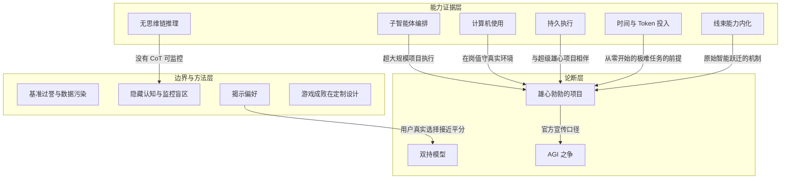

# 定制设计是游戏的硬骨头 · Bespoke Design, Not Implementation

> AI 能实现游戏机制、做出好看画面，但「让人真想玩」的定制设计无法由实现能力替代。

**领域** media-culture-education ｜ **类型** CONCEPTUAL ｜ **什么时候学** 做到这里再懂 ｜ **怎么算会了** 能判 ｜ **中心度** 0.017

## 费曼一下

Astra 能实现各种游戏机制、让画面惊艳，但"做一个视频里好看的游戏"和"做一个人们真想玩的游戏"是两回事——默认情况下得到的只是空壳。承重在于：这是全文最清晰的一条能力边界，提醒 AI 创作类能力"实现"与"设计"之间隔着鸿沟。

## 二、概念架构图

## 原文 context

We have learned that the hard part of gaming is bespoke design, not implementation.

## 掌握证据（做到这些才算会）

- 能举出实现能力强但设计仍为空壳的 AI 生成游戏例子
- 能判断某个 AI 作品缺的是实现能力还是定制设计

## 验收问句

> 能否判断一个 AI 生成游戏缺的是实现还是{{name}}？

## 出场

- AI 内参 260912 ｜ 《GPT-6-Astra 能做很多雄心勃勃的事情》 ｜ https://thezvi.substack.com/p/gpt-6-astra-can-do-ambitious-things?utm_source=tldrai

## 别名

`Bespoke Design, Not Implementation`
