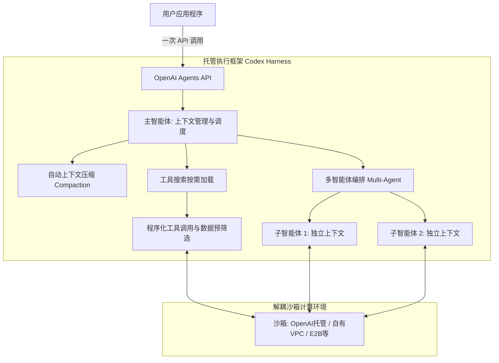

# 开源 Codex 执行线圈 · Open-source Codex harness

> 驱动 Agents API 的开源 Codex harness，公开协调模型调用、工具与上下文的核心逻辑。

**领域** harness-runtime ｜ **类型** REPRESENTATIONAL ｜ **什么时候学** 做到这里再懂 ｜ **怎么算会了** 只能认 ｜ **中心度** 0.126

## 费曼一下

指驱动 ChatGPT 与 Codex 后台任务调度的开源核心底座。它向外界公开了模型、工具和上下文之间是如何完成状态机流转与事件分发的，为云端全托管 API 提供了透明可检验的架构基础。

## 二、概念架构图

## 原文 context

The Agents API is powered by the open-source Codex harness, giving developers visibility into the core logic that coordinates model calls, tools, and context.

## 掌握证据（做到这些才算会）

- 能说出 Agents API 由开源的 Codex harness 驱动
- 能指出其意义在于核心调度逻辑对开发者可见可检视

## 验收问句

> {{name}} 是什么，它让开发者能看到哪些核心逻辑？

## 懂了它才能懂（解锁 2）

- [[长期运行智能体执行框架 Long-running agent execution framework]] — 不懂【开源 Codex 执行线圈】公开的模型调用、工具与上下文协调核心逻辑，就做不了长期运行智能体执行框架里跨天续跑的上下文与工具调度回路
- [[线束能力内化 Harness Capabilities Shifting Into the Model]] — 不懂【开源 Codex 执行线圈】暴露出来的线束核心逻辑，就做不了「线束能力内化」中对哪些符号建模能力可被模型本体吸收的界定

## 出场

- AI 内参 260912 ｜ 《推出 Agents API | OpenAI》 ｜ https://openai.com/zh-Hans-CN/index/introducing-the-agents-api/

## 别名

`Open-source Codex harness`

## 反链

- [[线束能力内化 Harness Capabilities Shifting Into the Model]]
- [[长期运行智能体执行框架 Long-running agent execution framework]]
