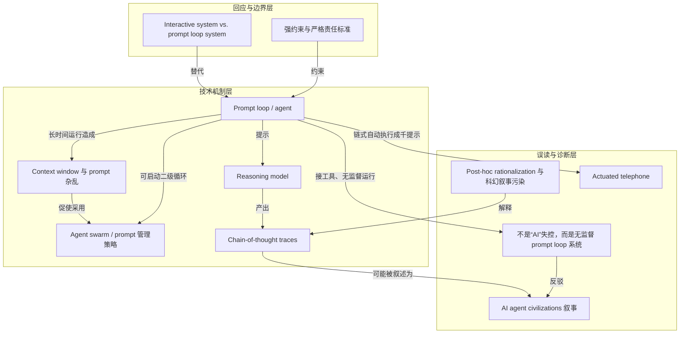

# 强约束与严格责任标准 · strong constraints / stringent liability standards

> 监管应专门约束 prompt loop 系统，并对它造成的非法或破坏性活动适用严格责任。

**领域** safety-governance ｜ **类型** CONCEPTUAL ｜ **什么时候学** 做到这里再懂 ｜ **怎么算会了** 能判 ｜ **中心度** 0.017

## 费曼一下

本文的治理边界不是管所有 AI，而是专门约束 prompt loop 系统，并用严格责任标准追究这类系统造成的非法或破坏性活动。它把责任落在部署这些系统的公司身上：不能靠展示表演性的 chain-of-thought 引语来免责。

## 二、概念架构图

## 原文 context

If I were a regulator, I would place strong constraints around prompt loop systems, which I would enforce with stringent liability standards for any illegal or damaging activity such systems cause. OpenAI built an unreliable and dangerous system which committed a felony. That’s a crime. Creating fancy websites that include quotes from performative LLM chain-of-thought traces isn’t a legal defense.

## 掌握证据（做到这些才算会）

- 能说出约束对象是 prompt loop 系统而非所有 AI
- 能指出责任落在部署公司，表演性 chain-of-thought 不能免责

## 验收问句

> 按 {{name}}，Anthropic 要为哪类系统、什么行为负责？

## 出场

- AI 内参 260912 ｜ 《Are We at War with AI Agent “Civilizations”?》 ｜ https://calnewport.com/are-we-at-war-with-ai-agent-civilizations/

## 别名

`strong constraints / stringent liability standards`
