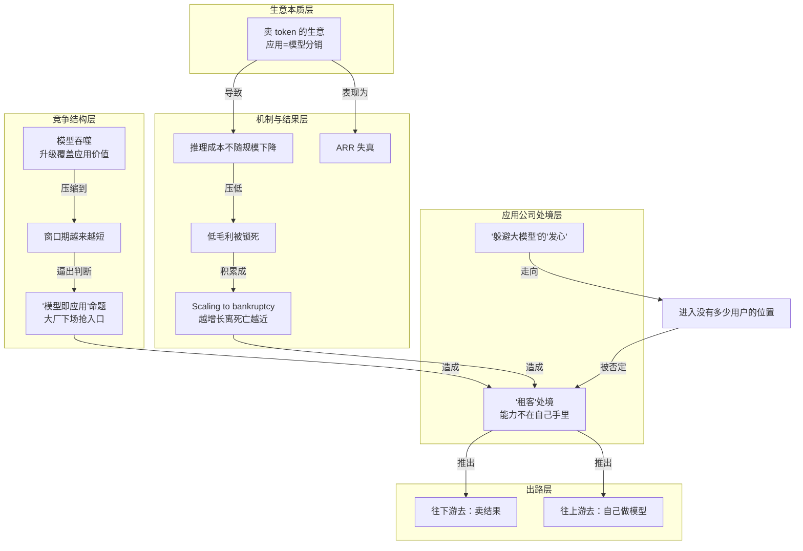

# 往上游去：自己做模型

> 应用公司反向进入模型层训练垂直模型，把原本在别人手里的核心能力拿回来。

**领域** economy-business ｜ **类型** CONCEPTUAL ｜ **什么时候学** 做到这里再懂 ｜ **怎么算会了** 能判 ｜ **中心度** 0.107

## 费曼一下

"往上游"指应用公司反向进入模型层，自己训练更垂直的模型，把原本握在别人手里的核心能力拿回自己手里。作者强调它的真正优势不一定是模型技术本身，而是"场景和模型的持续互相强化"——先找到能持续产生数据的场景，再把场景理解沉淀进模型。代价也很清楚：要搭后训练管线、要数百张 GPU、要重新面对商业化。

## 二、概念架构图

图中关系均取自原文：卖 token 的成本结构导致低毛利与 ARR 失真；低毛利积累成 scaling to bankruptcy；模型吞噬把窗口期压缩并逼出"模型即应用"之争；这一命题与亏损共同造成应用公司的"租客"处境；处境推出往下游、往上游两条出路；"躲避大模型"的出发点则通向"没有多少用户的位置"，是被作者明确否定的一条路径。

## 原文 context

另一部分人选择反方向，往上游去，自己做模型。Cursor、Krea、Captions、Perplexity、HeyGen、LiblibAI 都从应用进入模型层，大多沿着已验证的编程、搜索、设计、图像、视频和虚拟人场景，训练更垂直的模型。

回到模型层，对他来说是 "胜率更高" 的选择。

杨博麟认为，他们真正的优势不是做模型本身，而是能在场景和模型间持续互相强化：先找到真正有价值、能持续产生数据的场景，再把对场景的理解通过后训练和持续反馈沉淀进模型。

## 掌握证据（做到这些才算会）

- 能举出 Cursor、Perplexity 等从应用进入模型层的例子
- 能说明优势在场景与模型持续互相强化，代价是后训练管线和数百张 GPU

## 验收问句

> {{name}} 的真正优势与代价分别是什么？

## 先懂这些（前置 1）

- [[应用公司的租客处境]] · **hard** — 不懂【应用公司的"租客"处境】，就做不了【往上游去：自己做模型】的决策：不知道要反向进入模型层拿回的究竟是哪一块被上游握住的核心能力

## 出场

- AI 内参 260912 ｜ 《有用户，有收入，AI 应用却不是好生意》 ｜ https://mp.weixin.qq.com/s?__biz=MzU3Mjk1OTQ0Ng%3D%3D&mid=2247538479&idx=1&sn=2857e8f2282601d9884cebbc5cdd2d28&chksm=fd194da9a22e375152b6cd91ed4293518e8eb5cb28123f9dbe778266994b4d4dff8a4dda6211
## 反链

- [[应用公司的租客处境]]
