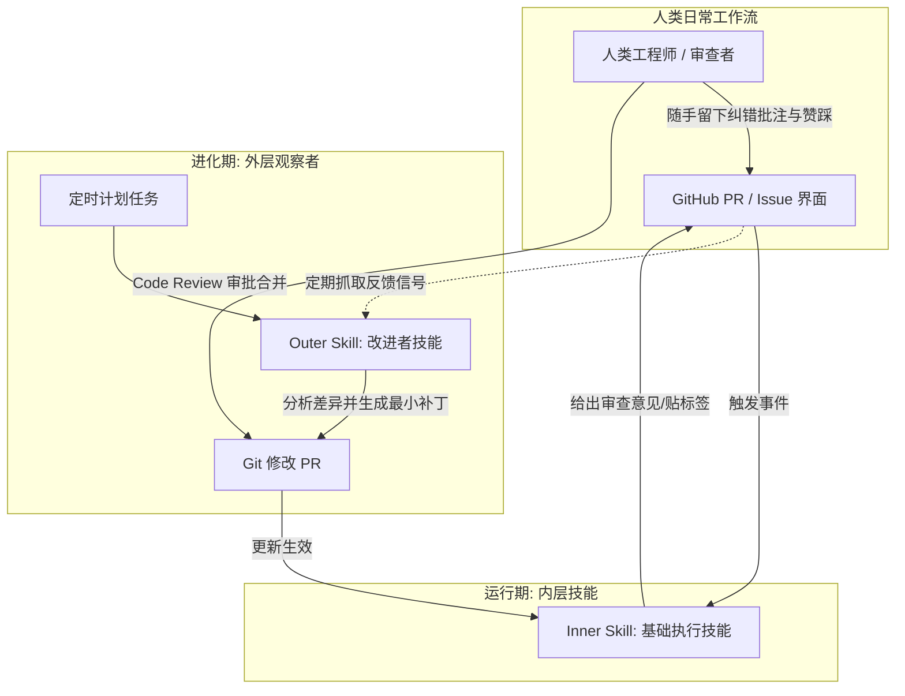

# 技能与记忆的本质区别 · Skills vs. Memory

> 技能是稳定程序性的'怎么做'，记忆是推理期自动写入、持续变动的状态

**领域** memory-retrieval ｜ **类型** CONCEPTUAL ｜ **什么时候学** 现在先懂 ｜ **怎么算会了** 能判 ｜ **中心度** 0.072

## 费曼一下

技能回答的是“做事的方法”，具有程序性、长期稳定性和跨会话通用性，每一次修改都必须经过验证；记忆回答的是“当下的事实与上下文”，是推理期间自动写入、随交互不断重写变动的动态状态。

## 二、概念架构图

## 原文 context

Skills are procedural and stable—"how to do X," run-agnostic, changed deliberately. Memory is auto-written by the agent at inference time and never stops changing.

## 掌握证据（做到这些才算会）

- 能用稳定性与写入方式两个维度区分二者
- 能判断某条信息该放进技能还是记忆

## 验收问句

> {{name}} 的差别体现在哪两个属性上？

## 懂了它才能懂（解锁 1）

- [[三层知识架构 Three-layer knowledge architecture]] — 不懂技能与记忆的本质区别，就做不了三层知识架构中把带溯源技能层与知识/经验层分开这件事。

## 出场

- AI 内参 260912 ｜ 《https://claude.com/blog/how-warp-builds-self-improving-agents-on-claude》 ｜ https://claude.com/blog/how-warp-builds-self-improving-agents-on-claude

## 别名

`Skills vs. Memory`

## 反链

- [[三层知识架构 Three-layer knowledge architecture]]
