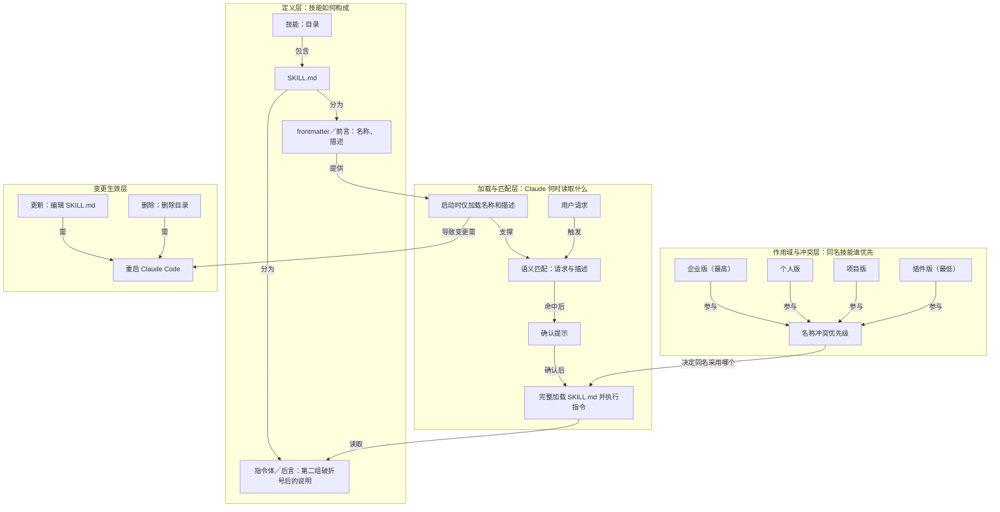

# 技能变更生效条件：编辑、删除、重启

> 改技能即改其 SKILL.md，删技能即删目录，之后必须重启 Claude Code 才生效

**领域** harness-runtime ｜ **类型** PROCEDURAL ｜ **什么时候学** 做到这里再懂 ｜ **怎么算会了** 能用 ｜ **中心度** 0.035

## 费曼一下

技能不是热更新对象。改技能就是改它的 SKILL.md；删技能就是删目录。因为 Claude Code 在启动时加载技能，所以创建、修改、删除后都要重启 Claude Code 才生效。这个操作边界直接来自前面的启动加载机制。

## 二、概念架构图

## 原文 context

要更新技能，请编辑其配置SKILL.md文件。要删除技能，请删除其配置文件目录。请务必重启 Claude Code以使更改生效。

Claude Code 会在启动时加载技能，因此创建技能后请重启游戏。

## 掌握证据（做到这些才算会）

- 能写出改、删技能对应的文件操作
- 能说出改动后必须重启才生效的原因

## 验收问句

> 改完技能 SKILL.md 后，{{name}}还需要做什么才生效？

## 出场

- AI 内参 260912 ｜ 《Claude 官方课程 · 第 2 课：技能的结构（SKILL.md 与 frontmatter）》 ｜ https://academy.claude.com/courses/introduction-to-agent-skills/creating-your-first-skill