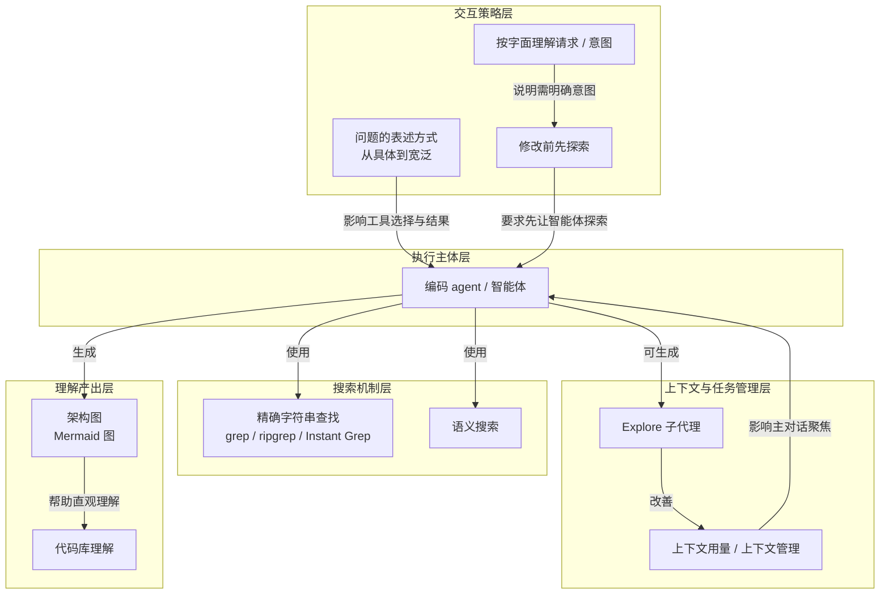

# 按字面理解请求 / 意图 · literal interpretation / intent

> 编码智能体按字面处理请求，未提供意图时自行判断，故需先理解代码库并明确要求。

**领域** spec-intent ｜ **类型** CONCEPTUAL ｜ **什么时候学** 现在先懂 ｜ **怎么算会了** 能判 ｜ **中心度** 0.072

## 费曼一下

编码 agent 不会自动知道你的真实意图，它按字面处理请求；没提供意图时，它会自行判断。本文用它解释为什么在需要遵循现有模式的修改里，先理解代码库并明确说出要求更重要。这个机制把“修改前先探索”和“明确提问”连起来。

## 二、概念架构图

## 原文 context

编码 agent 会按字面理解您的请求。如果您没有提供意图，它们会自行做出最佳判断。有时这样做效果不错。但对于需要遵循现有模式的更改，先理解代码库并明确知道该提出什么要求，通常能获得更好的结果。

## 掌握证据（做到这些才算会）

- 能解释为什么遵循现有模式的改动尤其需要先明确意图
- 能举出智能体自行判断导致偏离预期模式的情形

## 验收问句

> 如果不说清意图，{{name}} 会让智能体做出什么行为？

## 懂了它才能懂（解锁 1）

- [[修改前先探索]] — 不懂【按字面理解请求 / 意图】（智能体按字面处理、未给意图时自行判断），就做不了【修改前先探索】这件事的必要性判断：为什么提出修改前必须先把现有实现与共享验证器摊开、把要求说清楚。

## 出场

- AI 内参 260912 ｜ 《理解您的代码库》 ｜ https://cursor.com/cn/learn/understanding-your-codebase

## 别名

`literal interpretation / intent`

## 反链

- [[修改前先探索]]
