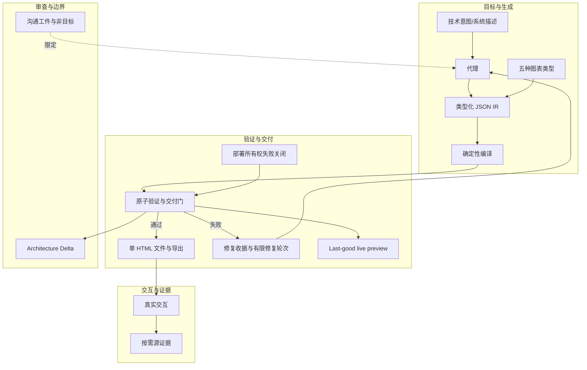

# 更新检查隐私边界 · update-check boundary

> 更新检查只 GET 固定稳定清单以显示可选提醒，不下载安装，也不上报版本、Agent、项目数据等。

**领域** safety-governance ｜ **类型** CONCEPTUAL ｜ **什么时候学** 做到这里再懂 ｜ **怎么算会了** 只能认 ｜ **中心度** 0.017

## 费曼一下

更新检查只 GET 固定稳定清单来显示可选提醒；绝不下载或安装更新，也不把版本、Agent、项目数据、提示、账户/设备 ID 或 ETag 发给服务器。用户可禁用。它是产品自身网络行为的绝对边界。

## 二、概念架构图

图中只保留能由原文关系支持的连接；更新检查隐私边界未与生成链形成可靠关系，故不入图。

## 原文 context

Archify may GET the fixed stable manifest solely to show an optional reminder; it never downloads or installs updates. Successful checks wait about 72 hours (±20%); active use retries failures after 6, then 24 hours. The server sees normal HTTP metadata (IP and time), but receives no version, Agent, project data, prompts, account/device ID, or ETag. You decide whether and when to update. Set `ARCHIFY_UPDATE_CHECK_DISABLED=1` to disable networking and reminder-state writes.

## 掌握证据（做到这些才算会）

- 能说出服务器能看到与看不到的信息
- 能说出重试节奏与用户可禁用

## 验收问句

> 按 {{name}}，更新检查时服务器能收到什么、不能收到什么？

## 出场

- AI 内参 260912 ｜ 《Archify》 ｜ https://github.com/tt-a1i/archify

## 别名

`update-check boundary`
