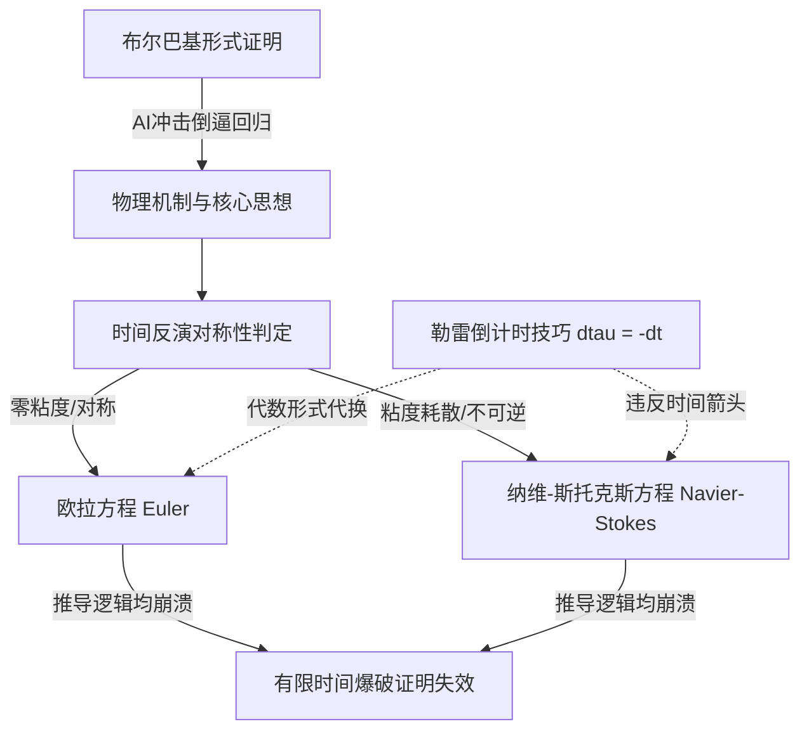

# 有限时间爆破失效 · Invalidation of finite time blowup

> AI 用 dτ=−dt 的写法，使流体有限时间爆破的证明在欧拉与纳维-斯托克斯方程上都失效。

**领域** verification-eval ｜ **类型** CONCEPTUAL ｜ **什么时候学** 现在先懂 ｜ **怎么算会了** 能判 ｜ **中心度** 0.072

## 费曼一下

指 AI 试图证明流体速度在有限时间内趋向无穷大（出现奇点）的结论彻底破产。AI 通过强行定义负微元，在欧拉方程中等同于设定了非法初始条件，在纳维-斯托克斯方程中则违反了能量耗散与时间不可逆性，证明在两套方程上均不成立。

## 二、概念架构图

## 原文 context

The AI proof setting dtau = -dt over the chosen interval invalidates the proof of finite time blowup for both the Euler and Navier-Stokes equations.

## 掌握证据（做到这些才算会）

- 能说明负微元在欧拉方程中等价于非法初始条件
- 能说明它违反纳维-斯托克斯的能量耗散

## 验收问句

> {{name}}具体错在哪一步假设上？

## 先懂这些（前置 1）

- [[勒雷奇点倒计时技巧 Leray's countdown trick]] · **hard** — 不懂【勒雷奇点倒计时技巧】里 τ=1−t 的变量替换及其时间反演含义，就做不了【有限时间爆破失效】的判断——即看不出 AI 写成 dτ=−dt 后，有限时间爆破的证明为什么在欧拉与纳维-斯托克斯方程上都不再成立

## 出场

- AI 内参 260912 ｜ 《“深奥的定理曾经稀少且晦涩，因此成为识别深刻思想的有效机制。人工智能打破了这一体系。”》 ｜ https://terrytao.wordpress.com/2026/09/13/deep-theorems-were-scarce-and-difficult-and-so-became-an-effective-mechanism-to-identify-deep-thought-ai-has-broken-this-system/?utm_source=tldrai

## 别名

`Invalidation of finite time blowup`

## 反链

- [[勒雷奇点倒计时技巧 Leray's countdown trick]]
