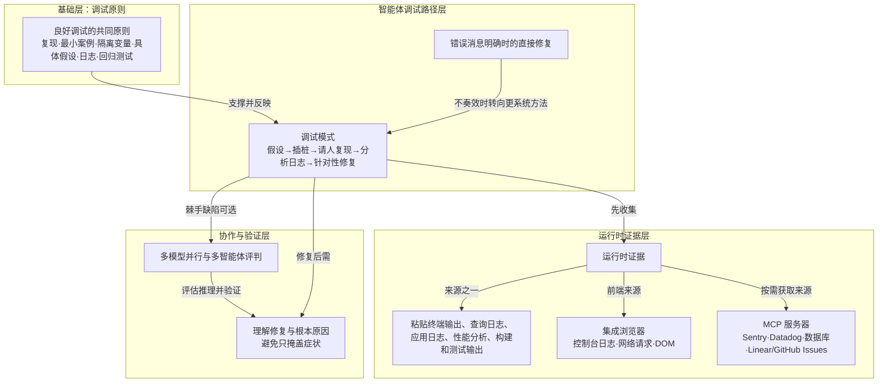

# 理解修复与根本原因

> 验证修复要看人能否解释因果链并确认根因，而不是看错误是否消失。

**领域** verification-eval ｜ **类型** CONCEPTUAL ｜ **什么时候学** 现在先懂 ｜ **怎么算会了** 能判 ｜ **中心度** 0.089

## 费曼一下

验证修复的标准不是错误是否消失，而是人能否解释因果链并确认根本原因。智能体可能加一个空值检查让报错消失，但底层数据不一致仍然存在。文章要求不断追问“为什么这个值是 null”“什么变化导致这种情况”“这是根本原因还是掩盖症状”，并用调查数据确认智能体是否找到真正根因。它承重，因为它把人的理解放在智能体建议之上，划出了智能体调试的质量边界。

## 二、概念架构图

## 原文 context

如果你不理解修复方案，就无法验证它是否正确。智能体可能会添加空值检查，让错误消失，但底层的数据不一致问题依然存在。

> 当智能体提出修复方案时，要不断追问，直到完全理解。为什么这个值是 null？是什么变化导致了这种情况？这是根本原因，还是只是在掩盖症状？

## 掌握证据（做到这些才算会）

- 能指出添加空值检查可能只是掩盖症状，底层不一致仍存在
- 能对修复提出“为什么这个值是 null”“这是根因还是掩盖症状”的追问

## 验收问句

> 当错误消失但底层数据不一致仍在时，{{name}}要求你继续追问什么？

## 懂了它才能懂（解锁 1）

- [[调试与根因修复]] — 不懂【理解修复与根本原因】（要看人能否解释因果链并确认根因，而不是看错误是否消失），就做不了折扣叠加测试失败时定位到折扣应用顺序这个根因并改 DiscountService.ts 这件事。

## 出场

- AI 内参 260912 ｜ 《查找并修复缺陷》 ｜ https://cursor.com/cn/learn/finding-fixing-bugs
## 反链

- [[调试与根因修复]]
