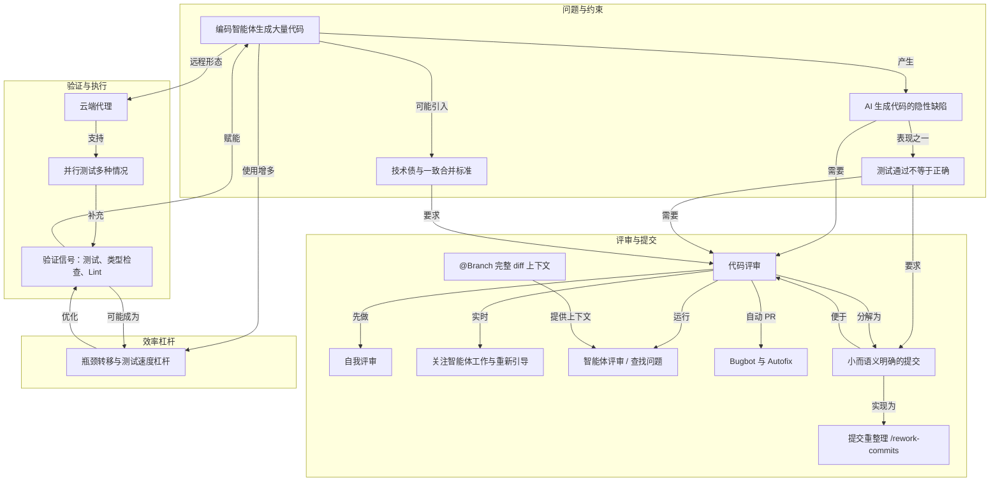

# 瓶颈转移与测试速度杠杆

> 并行使用智能体后瓶颈移到最慢公共环节（测试、类型检查、Lint、CI），提速有复利。

**领域** verification-eval ｜ **类型** CONCEPTUAL ｜ **什么时候学** 做到这里再懂 ｜ **怎么算会了** 能判 ｜ **中心度** 0.107

## 费曼一下

当多个智能体并行工作时，整体吞吐取决于最慢的公共环节，通常是测试、类型检查、Lint 或 CI。测试速度的改进有复利：每个会话、分支和智能体都会受益。智能体也可以代劳分析测试性能、找最慢测试、审计依赖等范围明确且可验证的任务。

## 二、概念架构图

## 原文 context

随着您使用的编码智能体越来越多，瓶颈会转移到系统中最慢的环节。这往往是等待测试套件完成、在整个代码库中运行类型检查和 Lint 检查，或 CI 流水线中的其他步骤。

每次与智能体对话都要付出这些时间成本。如果测试运行需要 10 分钟，而您并行启动了 10 个智能体，等待时间就接近两小时。将测试速度提升 50%，每次就能节省近一小时。

这些改进会在每个会话、每个分支和每个智能体中持续带来收益。

## 掌握证据（做到这些才算会）

- 能说出瓶颈会转移到测试套件、类型检查、Lint 或 CI 中较慢的环节
- 能说明测试提速的收益会在每个会话、每个分支和每个智能体上持续产生

## 验收问句

> 为什么{{name}}的收益会随智能体数量放大？

## 先懂这些（前置 1）

- [[验证信号]] · **hard** — 不懂【验证信号】（测试、类型检查、Lint 是智能体自查成果的反馈渠道），就做不了判断并行后瓶颈已移到测试/类型检查/Lint/CI 这个最慢公共环节并对其提速这件事。

## 出场

- AI 内参 260912 ｜ 《评审和测试代码》 ｜ https://cursor.com/cn/learn/reviewing-testing
## 反链

- [[验证信号]]
