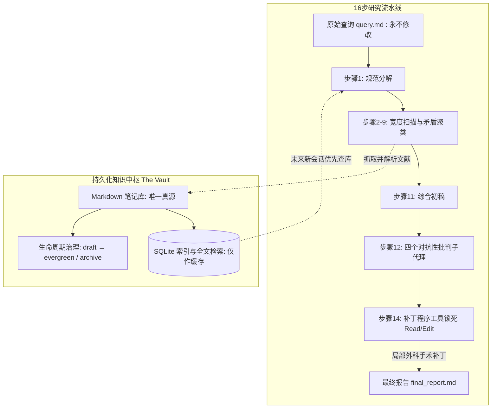

# 笔记生命周期策展 · Note curation lifecycle

> 每轮研究结束做一次策展，让笔记在 draft、evergreen、stale 等状态间流转

**领域** memory-retrieval ｜ **类型** PROCEDURAL ｜ **什么时候学** 做到这里再懂 ｜ **怎么算会了** 能用 ｜ **中心度** 0.017

## 费曼一下

每轮研究结束时由智能体对文献笔记进行状态晋级或退役治理：经过核实的内容逐步晋级为常青笔记（Evergreen），过时内容被标记为陈旧（Stale）并归档，保证知识库规模扩张的同时始终保持高信息密度。

## 二、概念架构图

## 原文 context

Every session ends with a curation pass, and notes move through draft → review → evergreen, or stale → deprecated → archive as material ages out. That's what keeps a vault from turning into a landfill of half-read pages.

## 掌握证据（做到这些才算会）

- 能列出笔记晋级与退役的状态路径
- 能解释策展如何避免知识库变成半读页面的垃圾场

## 验收问句

> {{name}} 中，笔记从草稿到常青要经过哪些状态？

## 出场

- AI 内参 260912 ｜ 《jordan-gibbs/hyperresearch：基于智能体的研究知识库。智能体收集、搜索并将网络研究成果整合到一个持久的、可搜索的维基中。》 ｜ https://github.com/jordan-gibbs/hyperresearch

## 别名

`Note curation lifecycle`
