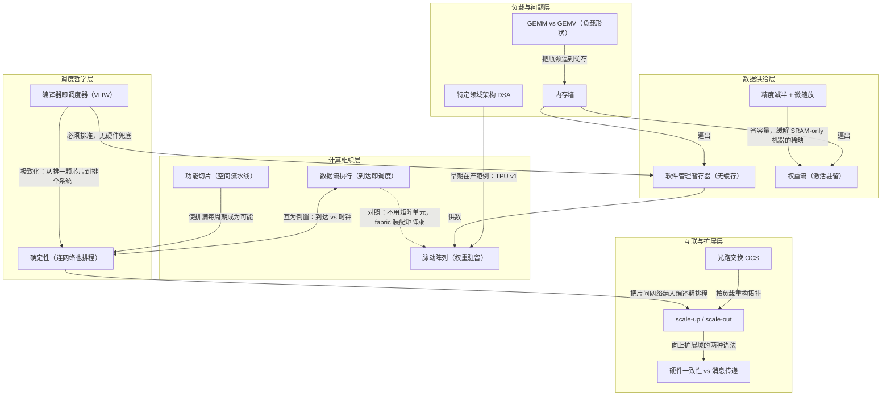

# 精度减半与微缩放 · precision halving, MX microscaling

> FP16→FP8→FP4 逐代位宽砍半，换约 2× 每瓦吞吐；用块级共享指数的 MX 微缩放找回精度。

**领域** geo-infrastructure ｜ **类型** CONCEPTUAL ｜ **什么时候学** 做到这里再懂 ｜ **怎么算会了** 能判 ｜ **中心度** 0.035

## 费曼一下

精度减半指 FP16→FP8→FP4 逐代把位数砍半，每砍一半换来约 2× 每瓦吞吐；微缩放是找回精度的手段——把共享指数做成块级（MX 格式），用更细粒度的缩放恢复低位宽丢掉的准确度，英伟达、AMD、TPU 用的是同一套开放格式。这个节拍承重有二：它是逐代性能曲线的引擎；它也反衬出 Cerebras 与 Groq 停在 16-bit 的张力——片上 SRAM 最稀缺、最需要 8-bit 省容量的机器，恰恰没拿到低精度数据通路（作者标为 open question）。

## 二、概念架构图

- 分层说明：负载与问题层是全文的出发点；数据供给层与计算组织层回答数据住哪、算什么；互联与扩展层回答芯片怎么连；调度哲学层是贯穿各层的分岔——交给编译器时刻表（TPU/Trainium/Groq），或交给数据到达（Cerebras），或留在硬件 warp 层级（NVIDIA，对应图中未单列的缓存加线程藏延迟路线，与 SCRATCH/COMPILER 两节点相对）。仅画原文明确支持的关系。

## 原文 context

Every generation buys roughly 2× per-watt throughput by cutting bits in half and restoring accuracy with a finer-grained scaling scheme

(block-level shared exponents that recover most of the accuracy lost at FP4)

## 掌握证据（做到这些才算会）

- 能说出约 2× 每瓦吞吐与块级共享指数恢复 FP4 精度的对应关系
- 能指出 Cerebras 与 Groq 停在 16-bit，最需要省片上容量的机器反而没拿到低精度数据通路

## 验收问句

> {{name}} 用什么手段补回砍位宽丢掉的精度？

## 出场

- AI 内参 260912 ｜ 《都承诺提供6GW的运维能力》 ｜ https://www.jacobpeake.com/ai-chip-architectures

## 别名

`precision halving, MX microscaling`
