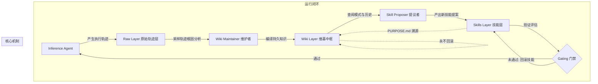

# 维基消融效应 · Wiki ablation effect

> 去掉 Wiki 访问后平均分从 63.7% 降至 48.7%，回落约 15 个百分点。

**领域** verification-eval ｜ **类型** CONCEPTUAL ｜ **什么时候学** 做到这里再懂 ｜ **怎么算会了** 只能认 ｜ **中心度** 0.017

## 费曼一下

实验证实若撤掉中间的 Wiki 知识层，仅靠提议者直接从原始轨迹修改技能，模型表现会断崖式下跌 15 个百分点。这证明持续积累的抽象知识库才是智能体解决复杂长尾缺陷的真正承重支柱。

## 二、概念架构图

## 原文 context

去掉 Wiki 访问后，平均分从 63.7% 降至 48.7%，回落约 15 个百分点。Wiki Maintainer 积累的跨迭代知识是 Skill Proposer 能解决复杂失败模式的前提。

## 掌握证据（做到这些才算会）

- 能复述 63.7%→48.7%、约 15 个百分点的消融结果
- 能据此判断 Wiki 层是解决复杂失败模式的前提而非可选装饰

## 验收问句

> {{name}} 的具体数据是多少，它说明 Wiki 层处于什么地位？

## 出场

- AI 内参 260912 ｜ 《谷歌重磅发布WikiSkill，技能可以自己进化了！》 ｜ https://mp.weixin.qq.com/s?__biz=MzIyNjM2MzQyNg%3D%3D&mid=2247725815&idx=1&sn=6dc8d200fbcabc937f0093929522430a&chksm=e96ba0747e94677b08172b24288c71cf370f6673d7918a21578bf83247eea6e9bc037caf398b

## 别名

`Wiki ablation effect`
