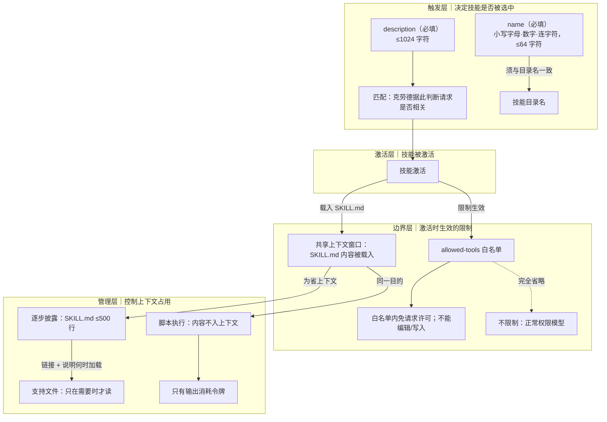

# 脚本执行

> 脚本不必读入上下文即可运行，只有输出消耗 token，SKILL.md 应写'运行脚本'

**领域** caching-cost ｜ **类型** CONCEPTUAL ｜ **什么时候学** 做到这里再懂 ｜ **怎么算会了** 能判 ｜ **中心度** 0.089

## 费曼一下

脚本是"运行"的对象，不是"阅读"的对象：它不必被读进上下文就能执行，执行完只有输出消耗令牌。因此 SKILL.md 里的写法关键是让克劳德去运行脚本，而不是去读取脚本内容。边界在于——省掉的是脚本正文进入上下文，而不是省掉脚本本身。

## 二、概念架构图

## 原文 context

脚本执行时无需将其内容加载到上下文中——只有输出会消耗令牌，从而保持上下文的高效性。

技能目录中的脚本无需加载其内容即可运行。脚本执行后，只有输出会消耗令牌。SKILL.md 文件中的关键指令是告诉 Claude 运行脚本，而不是读取脚本。

## 掌握证据（做到这些才算会）

- 能区分'运行脚本'与'读取脚本'两类指令
- 能说明省下的是脚本正文入上下文，不是脚本本身

## 验收问句

> {{name}}会把脚本正文塞进上下文吗？什么才消耗 token？

## 懂了它才能懂（解锁 1）

- [[约束型 API 与成本不平衡]] — 不懂【脚本执行】里『脚本不必读入上下文、运行期只有输出消耗 token』这套运行期成本模型，就做不了【约束型API与成本不平衡】中『判断一次请求实际烧掉多少、从而把 API 设计成成本可预测』这件事

## 出场

- AI 内参 260912 ｜ 《Claude 官方课程 · 第 3 课：写好 name 与 description》 ｜ https://academy.claude.com/courses/introduction-to-agent-skills/configuration-and-multi-file-skills

## 别名

`不入上下文`

## 反链

- [[约束型 API 与成本不平衡]]
