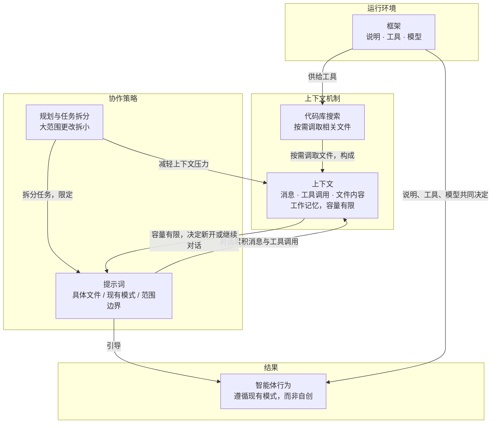

# 规划与任务拆分

> 大范围改动前先规划并把任务拆小；出现无关改动、误改文件、偏离重点时应停下拆分。

**领域** loop-autonomy ｜ **类型** PROCEDURAL ｜ **什么时候学** 现在先懂 ｜ **怎么算会了** 能用 ｜ **中心度** 0.27

## 费曼一下

在让智能体做跨多个文件的大改动之前，先规划、先把任务拆小。作者点出的失败症状很具体：出现无关改动、改到你不希望修改的文件、逐渐偏离重点——出现这些就该停下来看能不能拆分。对复杂功能的建议节奏是先有方案和规格说明，用首次对话定好方向，然后在后续更小的对话里迭代，这样更快。

## 二、概念架构图

图中“智能体行为”取自原文“智能体会遵循您的现有模式，而不是自行创造新模式”与“每个框架的行为会因调优方式和所用模型而略有不同”，作为提示词与框架共同作用的结果节点保留。

## 原文 context

最常见的错误之一是没有做好规划，就要求进行大范围更改。你可能会发现智能体做了无关的更改、编辑了你不希望修改的文件，或逐渐偏离重点。

如果发现这种情况，不妨停下来想想能否将任务拆分成更小的部分。

如果你正在规划一项复杂的功能，我们将在创建功能中介绍如何制定可靠的方案和规格说明。有了方案并开启首次对话后，通常在后续较小的对话中迭代会更快。

## 掌握证据（做到这些才算会）

- 能说出规划缺失时的三种失败症状
- 能说明复杂功能先用首次对话定方向、再在更小对话中迭代的节奏

## 验收问句

> 出现哪些症状说明 {{name}} 没做好？

## 懂了它才能懂（解锁 4）

- [[完整闭环]] — 不懂【规划与任务拆分】，就做不了【完整闭环】的规划阶段——把大范围改动拆成可逐步推进的小任务，并在出现无关改动、误改文件、偏离重点时停下重新拆分。
- [[可自行验证的步骤]] — 不懂【规划与任务拆分】，就做不了【可自行验证的步骤】中的“把工作拆成智能体能自己判断成没成的小步骤”——不会先规划拆小，步骤太大无法让智能体独立验证。
- [[监控告警自动触发智能体调查]] — 不懂【规划与任务拆分】，就做不了【监控告警自动触发智能体调查】——智能体无法在无人工介入下把故障诊断拆成可执行的排查子任务并避免偏题。
- [[关注智能体工作 停止与重新引导]] — 不懂【规划与任务拆分】，就做不了【关注智能体工作 / 停止与重新引导】——无法判断智能体是否偏离原定任务重点，也就无法决定何时停止、取消、还原并重新引导。

## 出场

- AI 内参 260912 ｜ 《与智能体协作》 ｜ https://cursor.com/cn/learn/working-with-agents
## 反链

- [[可自行验证的步骤]]
- [[完整闭环]]
- [[监控告警自动触发智能体调查]]
- [[关注智能体工作 停止与重新引导]]
