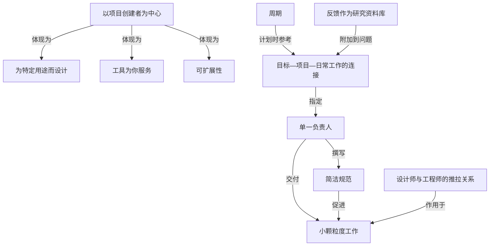

# 设计师与工程师的推拉关系

> 设计师向前推创意、工程师往回拉可行性，形成自然推拉，最优者两种才能兼具。

**领域** agent-org ｜ **类型** CONCEPTUAL ｜ **什么时候学** 做到这里再懂 ｜ **怎么算会了** 只能认 ｜ **中心度** 0.072

## 费曼一下

这是两种角色在项目中的协作模型——设计师往前推（探索创意、推动思考），工程师往回拉（盯可行性、挑战思路、把想法落地）。作者强调这种张力是"自然的推拉"，而非谁服从谁，并且最好的创造者两种能力兼具。它为"项目怎么被做出来"补上人的维度。

## 二、概念架构图

材料本身是一份并列的原则清单，多数条目平行铺开；下图只保留原文能支持的分层与关系，边标注的是原文给出的关系（如"撰写""附加到""参考"）。其余并列原则不再强行连边。

## 原文 context

设计师和工程师应该在项目中通力合作，形成自然的推拉关系。设计师运用他们的技能探索创意，推动团队的思考。工程师则着眼于实施方案，挑战既有的思维模式，并将最终的创意变为现实。优秀的创造者往往兼具这两种才能。

## 掌握证据（做到这些才算会）

- 能描述一次设计师推进与工程师回拉的具体分歧
- 能指出团队成员中谁兼具两种能力

## 验收问句

> 你们项目里的 {{name}} 具体表现在哪次争论上？

## 先懂这些（前置 1）

- [[可行性分析]] · **soft** — 不懂【可行性分析】，就做不了【设计师与工程师的推拉关系】里 ⟨工程师往回拉的那一手——用技术与成本判断把设计拉回地面⟩

## 出场

- AI 内参 260912 ｜ 《原则与实践（Linear 的产品原则）》 ｜ https://linear.app/method/introduction
## 反链

- [[可行性分析]]
