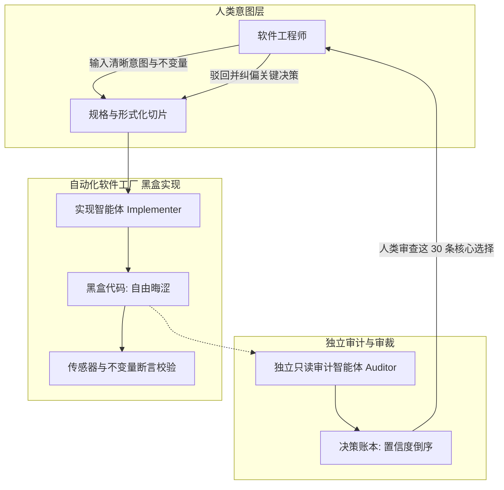

# 软件工厂全景闭环 · Software factory loop

> 由侦测业务迷雾、固化形式规格、驱动切片构建、审查决策账本组成的软件工厂闭环。

**领域** loop-autonomy ｜ **类型** CONCEPTUAL ｜ **什么时候学** 做到这里再懂 ｜ **怎么算会了** 能判 ｜ **中心度** 0.181

## 费曼一下

指由“侦测业务迷雾 → 固化形式规格 → 驱动切片构建 → 审查倒序决策账本”组成的流水线体系。在这个工厂里，人类工程师负责输入清晰意图和审查关键架构裁决，AI 负责在黑盒中高速吐出实现代码。

## 二、概念架构图

## 原文 context

The reason is that the job was never writing code. Engineering is about solving problems. That's the actual difference between being a programmer and being an engineer - a programmer's output is code, an engineer's output is a solved problem, and code was only ever the medium we happened to solve it in.

## 掌握证据（做到这些才算会）

- 能画出闭合流水线的各环节及人与 AI 的分工
- 能区分程序员的产出是代码、工程师的产出是被解决的问题

## 验收问句

> 能否讲清{{name}}各环节里人和 AI 各做什么？

## 先懂这些（前置 2）

- [[雄心勃勃的项目 Ambitious Projects]] · **hard** — 不懂【雄心勃勃的项目】，就做不了【软件工厂全景闭环】的 ⟨驱动切片构建以完成跨多天的大活⟩
- [[持久执行 Never Quits]] · **soft** — 不懂【持久执行】，就做不了【软件工厂全景闭环】的 ⟨驱动切片构建持续进行直到闭环完成⟩

## 懂了它才能懂（解锁 1）

- [[外层改进者技能 Outer Improver skill]] — 不懂【软件工厂全景闭环】，就做不了【外层改进者技能】的 ⟨向内层基础技能提出最小改进补丁⟩

## 出场

- AI 内参 260912 ｜ 《Building software factories (with no slop)》 ｜ https://x.com/dzhng/status/2090252351533973768/?rw_tt_thread=True

## 别名

`Software factory loop`

## 反链

- [[持久执行 Never Quits]]
- [[雄心勃勃的项目 Ambitious Projects]]
- [[外层改进者技能 Outer Improver skill]]
