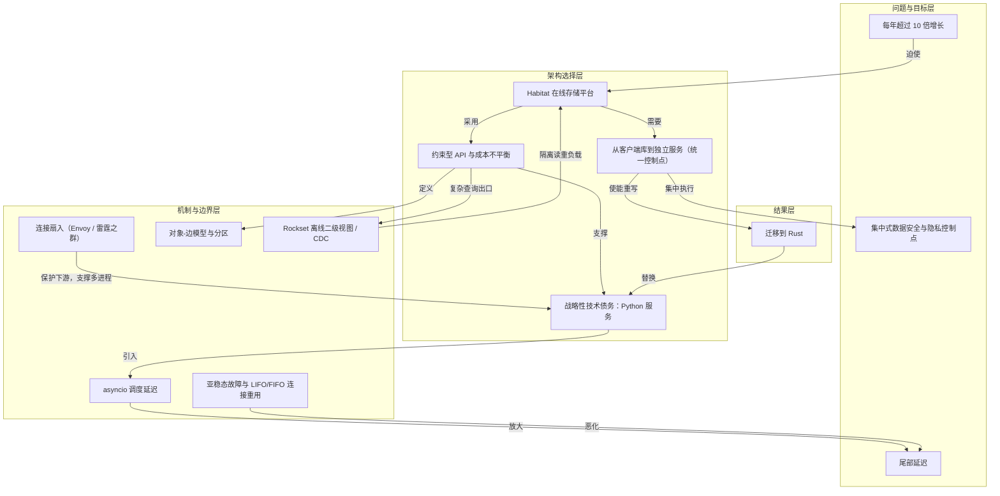

# 迁移到 Rust · Python→Rust

> 平台成熟后，两名工程师用 Codex 与 GPT-5.5 把整个 Python 服务重写为 Rust，承接 95% 生产请求。

**领域** code-engineering ｜ **类型** CONCEPTUAL ｜ **什么时候学** 做到这里再懂 ｜ **怎么算会了** 只能认 ｜ **中心度** 0.072

## 费曼一下

这是战略性技术债务的收束。平台成熟、增长继续加速，团队终于把 Python 服务重写为 Rust。两名工程师借助 Codex 和 GPT-5.5 完成整个服务重写，Rust 服务处理 95% 生产请求，并且 CPU 效率、内存效率和延迟都显著优于 Python。它验证了先前“未来编码模型会让迁移成为可能”的赌注。

## 二、概念架构图

## 原文 context

In Q2 2026, with just 2 engineers, Codex, and GPT‑5.5, we were able to rewrite the entire service in Rust. This new Rust service is now handling 95% of our production requests; we’ll be deprecating Python entirely in the coming weeks. Our data shows the Rust service is 6x more CPU efficient and 15x more memory efficient than the Python version, with significantly lower average and tail latencies.

## 掌握证据（做到这些才算会）

- 能说出重写由 2 名工程师借助 Codex 与 GPT-5.5 完成，Rust 服务已处理 95% 生产请求
- 能指出 Rust 服务在 CPU 效率、内存效率与延迟上显著优于 Python，且将停用 Python

## 验收问句

> {{name}} 如何兑现了先前承担技术债的赌注？

## 先懂这些（前置 1）

- [[分解为小颗粒度工作]] · **soft** — 不懂【分解为小颗粒度工作】，就做不了【迁移到 Rust】的「两名工程师把整个 Python 服务的重写切成小颗粒、逐块建问题、逐块交付与审查」这件事——整块重写既无法审查，也拿不到逐块完成的推进反馈。

## 出场

- AI 内参 260912 ｜ 《Rapidly scaling online storage to serve over 1 billion ChatGPT users（存储平台 Habitat 的扩容复盘）》 ｜ https://openai.com/index/scaling-storage-one-billion-users-part-one/

## 别名

`Python→Rust`

## 反链

- [[分解为小颗粒度工作]]
