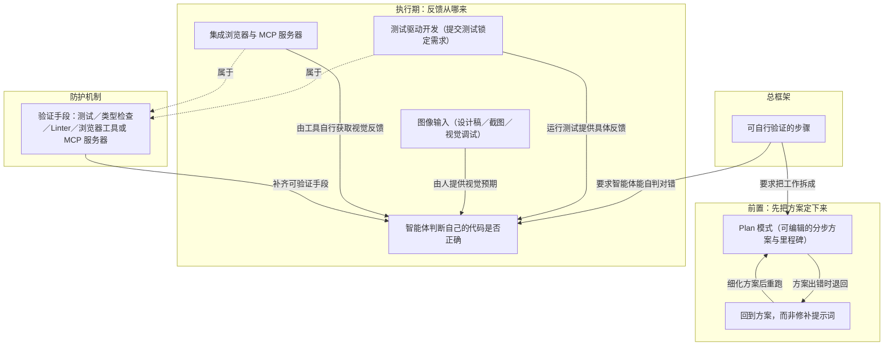

# 验证手段

> 测试、类型检查、Linter、浏览器工具四类手段，让智能体自己发现输出错误。

**领域** verification-eval ｜ **类型** CONCEPTUAL ｜ **什么时候学** 现在先懂 ｜ **怎么算会了** 能判 ｜ **中心度** 0.231

## 费曼一下

这是开头所说的"防护机制"落到实处的清单：四类手段各管一层正确性——行为、结构、风格、UI，合起来决定智能体能不能自己发现错误。作者给的判据很直白：无法验证输出，你日后就要花更多时间修正。落到实践上，判断一项功能该怎么做的标准之一，是先问"智能体靠什么知道它做对了"。

## 二、概念架构图

分四层：总框架决定一切；前置层在动手前把方向和步骤固定下来；执行层说明反馈从哪几条路来，并统一汇入"自我验证"；最下层是防护机制清单，其中测试与浏览器工具本身也是清单里的成员。

## 原文 context

快速开发功能时，最大的风险是跳过验证。智能体可以快速生成大量代码，但一味追求速度而不保证正确性，日后反而会增加工作量。

以下是帮助智能体验证其工作成果的具体方法：

* 验证逻辑和行为的**测试**

* 验证结构正确性的**类型检查**

* 强制执行代码风格和模式的 **Linter**

* 获取 UI 更改反馈的**浏览器工具或 MCP 服务器**

如果智能体无法验证其输出，后续你将花费更多时间进行修正。

## 掌握证据（做到这些才算会）

- 能列出四类验证手段各管哪一层正确性
- 能对一项功能先问它靠什么知道做对了

## 验收问句

> 一项新功能该配哪些{{name}}，你按什么判断？

## 懂了它才能懂（解锁 2）

- [[智能体判断自己的代码是否正确]] — 不懂【验证手段】（测试、类型检查、Linter、浏览器工具各怎么跑、怎么看结果），就做不了智能体跑测试、看失败并据此改代码来判断产出对不对这件事。
- [[测试驱动开发 TDD]] — 不懂【验证手段】，就做不了先提交测试锁住需求、再让智能体在不改测试的前提下把测试跑到全绿这件事。

## 出场

- AI 内参 260912 ｜ 《创建功能》 ｜ https://cursor.com/cn/learn/creating-features

## 别名

`防护机制`

## 反链

- [[智能体判断自己的代码是否正确]]
- [[测试驱动开发 TDD]]
