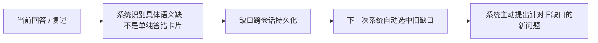

# 知所栖 135 × 知乎黑客松外部深度研究

## 执行摘要

本报告只回答材料包指定的五个问题；材料中已经列入“不要重做”的学习科学、2 Sigma、llm_wiki 九条核查等内容均按既有事实处理，不重新证明，也不把尚未上线的「知所栖 135」写成已有用户或效果验证。fileciteturn0file0

| 问题 | 本轮新增结论 | 对路演最重要的改动 |
|---|---|---|
| 知乎黑客松官方口径 | **当前公开一手信息能确认的是 2026 年 5 月 12–16 日的「AI 脑洞实验室」三赛道；未找到与你们 9 月 13–15 日这一场对应的公开官方规则页，因此不能把五月规则、评分权重或提交要求移植到九月场。**主办方报名页明确说评分标准在另一个开发者手册中，但该手册公开抓取不可读。 citeturn25view0 | 路演/内部文档里把任何“官方评分权重是……”删到拿到九月场手册之后；目前只保留已核实的赛制事实。 |
| 缺口 → 下次主动回问 | **截至 2026-09-11，我没有找到可公开审计、完整实现“从本轮语义缺口自动落账 → 跨会话保留 → 下次由系统主动选择该缺口并回问”的已运行先例。**但 2026 年的 Inno Agent 已逼近这个边界：它公开实现了 misconception 状态、跨会话记忆、review queue/next actions 和 proactive scheduler，只是没有公开证明最后那根自动桥已经接上。 fileciteturn3file0 fileciteturn6file0 | 可以写“**公开可查范围内检索过但未发现完整闭环先例**”，不要再写“零先例”“没人做过”。 |
| 强制复述 / 测验门禁 | **2022–2026 未找到干净的“强制 vs 可选复述”或“门禁 vs 自由跳过”的随机对照/元分析，因此强制本身的增量效应量目前不能报。**2025 有“50% 门槛的强制提取测试”，但不是与可选组随机对照；2026 的自我解释实验甚至得到策略主效应为零。 citeturn25view2turn19search0 | “限速器有学习效果”降级为“限速器确保发生一次可观察的提取事件”；**跳过仍应保留且标未验收**，不要宣传强制本身已被证明优于可选。 |
| 「下一教学动作」竞争面 | **这个格子不是空白：Area9 的当前官方文档甚至逐字写“decides what to do next”，ALEKS 长期做 next-ready topic，松鼠 Ai 做诊断→练习→测试的实时路径；2026 开源 Inno Agent 又出现 `next_actions`。**LearnVector 一手材料只承诺 one-to-one、plan a path、adapt、mastery，并没有说“学的单位 = 下一个教学动作”。 citeturn26view0turn26view1turn26view5turn26view6 | **删掉“与吴恩达同构”**；换成“与 LearnVector 同题，但我们把命题收窄成一个 48 小时可现场验证的动作闭环”。 |
| 获奖项目怎样 demo | 近两年一手获奖页反复出现的不是“功能最多”，而是**一句话就能说出输入→AI 介入→可见结果，现场再把同一状态变化做出来**；Google 2024 总冠军 Jayu、影响力奖 Vite Vere、Prospera 都是这种结构，且官方获奖页直接挂演示视频。 citeturn26view3 | 知所栖不要演完整课程；演**“故意漏一点 → 系统抓到 → 关闭/新开一次学习 → 旧漏点变成第一个问题 → 补上销账”**这一条闭环。 |

下面的“未找到”均表示**检索过、但在本轮可公开审计的一手来源范围内未找到**，不等于证明其不存在。

## 知乎黑客松官方评审口径

**结论：** **截至 2026-09-11，可公开核实的一手官方入口只足以确认 2026 年 5 月场的三条赛道、时间、队伍规模和知乎 Token/Open Platform 要求；评分维度与权重、提交物、外部数据源细则以及与你们 9 月 13–15 日场次对应的官方规则文本均未找到公开可读版本，因此五月规则不能当作九月比赛的官方评审口径。** [主办方报名页](https://zhihuzued.wjx.cn/vm/Y1JEOWs.aspx) citeturn25view0

**证据：**

| 要核实的项 | 一手证据与原文短引 | 判定 |
|---|---|---|
| 官方活动与时间 | [知乎 Hackathon｜AI 脑洞实验室报名页](https://zhihuzued.wjx.cn/vm/Y1JEOWs.aspx)：原文为“**5 月 12 日 赛事正式开赛**”“**5 月 16 日 决赛路演**”。[一手·主办方报名入口] citeturn25view0 | **已核实，但这是五月场**；与材料包的 9 月 13–15 日不是同一时间。 |
| 主题赛道 | 同页逐项列出“**「灵感引擎」知乎✖️创作**”“**「引力场」知乎✖️社交**”“**「刘看山」知乎✖️ip**”。[一手·主办方报名入口] citeturn25view0 | 三赛道仅能确认五月场。 |
| 队伍与线上/线下形式 | 同页给出 1–5 人选项，并写本届采用“**线上 + 线下**”双模式。[一手] citeturn25view0 | 已核实五月场。 |
| 知乎平台接入要求 | 同页要求填写知乎 token，并说明“**每队需提供一个，用于开赛后创建队伍及开放平台使用**”。[一手] citeturn25view0 | 可以证明官方预期参赛作品可用知乎开放平台；**不能由此推出外部数据源允许/禁止规则**。 |
| 评分维度与权重 | 报名页只明确指向《开发者手册》，并写“**手册内详细说明项目创作要求、赛事规则及评审标准**”。[一手] citeturn25view0 | **检索过没找到公开可读正文**；因此任何百分比权重现在都不应写死。 |
| 提交物要求 | 同上，报名页本身没有公开展开最终提交格式。 citeturn25view0 | **检索过没找到**。 |
| 外部数据源/第三方材料规则 | 公开报名页只确认知乎 token/Open Platform；没有足够一手文字说明 GitHub、外部 API、第三方数据、预制资产、赛前代码等边界。 citeturn25view0 | **检索过没找到**，不能推定“都允许”或“都禁止”。 |
| 官方活动主页面 | [知乎活动页](https://www.zhihu.com/parker/campaign/2032428820930750138?zh_hide_nav_bar=true)仍存在，但当前公开抓取转入知乎安全验证页，无法从正文取得可审计的评分原文。[一手·知乎域名] citeturn25view1 | 能证明入口存在，不能填补规则正文。 |
| 获奖项目形态 | 同届参赛者自己公开的“赛博刘看山”材料把产品描述为把知乎创作、旅行记录、兴趣关注与 AI 对话装进**低功耗墨水屏硬件**，其参赛者自述获得二等奖。[一手·项目方/参赛者，而非主办方排名公告] citeturn14search0turn14search3 | 至少说明**硬件伴侣 + AI**也进入高位奖项；但完整前三名/全部获奖形态的主办方一手榜单**未找到**，因此不拿它推导“官方偏好某种产品形态”。 |

这里最值得注意的是一个**场次错配**：材料包明确写你们 2026 年 9 月 13 日 10:00 开赛、9 月 15 日 10:00 提交；公开报名页则明确是 5 月 12 日开赛、5 月 16 日决赛。fileciteturn0file0 citeturn25view0 在找到九月场官方手册前，不能把五月的赛道或隐含评审偏好套过来。

**可信度：** 赛道、五月时间、1–5 人、Token/Open Platform 要求为**高可信一手**；评分权重、提交物、外部数据规则和九月场规则为**未找到**；“赛博刘看山二等奖及其产品形态”有参赛项目方一手自述，但缺主办方公开榜单交叉确认，因此为**中等可信，不足以代替官方获奖清单**。citeturn25view0turn14search0turn14search3

**对我们的含义：** 现在只改两处文字，不增加开发量：第一，把任何类似“**官方最看重创新 X%、完成度 Y%**”的句子删掉，改成“**九月场评分权重待官方手册确认**”；第二，路演策略不要根据五月获奖项目反推评委偏好，而继续按**一句话问题—可运行闭环—证据边界**组织。比赛开始拿到官方手册时，优先只检查三件事：评分权重、赛前资产/外部 API 边界、最终提交物；这三项能在几分钟内决定文案和交付清单，不需要重构产品。

## 缺口发现后下次主动回问的公开先例

**结论：** **截至 2026-09-11，我在公开论文、产品文档和开源代码中检索过但未发现一个能被一手材料完整证明“本轮识别具体语义缺口 → 持久化该缺口 → 跨会话自动选择它 → 系统在下一次主动向用户回问”的已运行闭环；2026 年 Inno Agent 已成为非常接近的反例候选，所以最稳妥的话术是“公开可查范围内未发现完整闭环”，而不是“没有先例”。** [Inno Agent 仓库](https://github.com/hhyqhh/inno-agent) fileciteturn3file0

**证据：** 我采用了比“有没有复习提醒”更严格的四步判据；只要少一步，就不算你们要找的先例。

| 候选 | 一手材料真正证明了什么 | 缺的那一步 | 判定 |
|---|---|---|---|
| **Inno Agent，2026，开源** | README 明写“**misconception diagnosis**”、L1 中保存 `misconceptions`，L3 有“**cross-conversation retrieval**”，同时有“**proactive scheduler**”；代码还公开 `review_due_at`、`next_actions`，Context Pack 会收集 active misconceptions。[一手·代码仓库] [仓库](https://github.com/hhyqhh/inno-agent) fileciteturn3file0 fileciteturn4file6 fileciteturn8file7 | 没有找到代码证明“**检测到某个 misconception → 自动创建下一次 scheduler job → 对该 misconception 主动提问**”这一桥。Scheduler 与 learner-state 两部分均存在，不等于两者已自动闭环。 | **最接近，但不满足严格判据。** |
| **Inno Agent Learner State v2** | 设计文档把状态明确输出到“**Context Pack：下一轮教学策略**”和“**Review Queue：待复习与待诊断概念**”；并要求误区修复显式关联 `misconception_id`。[一手·设计文档] [设计文档](https://github.com/hhyqhh/inno-agent/blob/main/docs/learner-state-engine-design.md) fileciteturn6file0 | 文档自己标记状态为 **Draft**，并说明若干前端、迁移和真实数据校准仍未完成；“review queue”仍不是“下一次主动发问”。 | **架构先例，不是已证实运行闭环。** |
| **Lexicor，2026** | 官方页面公开声称有 persistent cross-session student memory、misconception detection、autonomous session planning，结构上同样非常接近。[一手·厂商官方页] citeturn16search3 | 公开材料没有提供一个可审计 trace，证明“上一会话的具体误区”在下一会话被自动转成主动问题。 | **商业产品近邻；精确功能未核实。** |
| **SocratesAI，2026 Hackathon** | 项目公开说明会跨会话保存 misconceptions，并在检测到误区时自动插入 remedial sub-lessons。[一手·项目页] citeturn16search13 | 是黑客松原型；“补救内容”不等于“下一次系统主动回问旧漏点”，也没有公开运行数据。 | **机制近邻，不是所求先例。** |
| **2026 教育/LLM 论文方向** | 检索到的 cross-session memory、long-term tutor memory、consultation tutor 等论文证明研究界正在做持久学生模型与问题生成；例如 ConsultCraft 的未来工作仍把结合评估/调度信息精准针对知识缺口列为后续方向。 citeturn17search7turn17search13turn17search15 | 没有找到公开部署、按旧语义漏点跨会话主动回问的完整实现。 | **论文近邻，不满足“已运行公开先例”。** |

特别值得更新材料包的一点是：原材料把“无同构先例”主要建立在 SuperMemo、mnemonic medium 等历史比较上；2026 年的 Inno Agent 已经让这个空白变窄了。fileciteturn0file0 它公开的数据结构甚至已经出现 `misconceptions`、`review_due_at`、`next_actions` 和 proactive scheduler，因此现在再说“**从来没人把缺口持久化到下一步**”会被代码层面的反例击中；真正还没有被公开证明的是**从语义误区自动连到下一次主动发问的最后一跳**。fileciteturn4file6 fileciteturn5file1 fileciteturn8file7

**可信度：** “Inno Agent 各组件存在”是**高可信一手代码证据**；“没有找到完整自动桥”属于**经过定向代码搜索后的阴性结果**，不是不存在证明；Lexicor 属厂商自述而缺少公开代码/行为 trace，可信度**中等**；“全球不存在”这一强命题**不成立，也不应说**。本轮直接检索过的公开库包括 Web/Google Scholar 式索引、arXiv、ACL Anthology、PubMed、GitHub、Hugging Face；**CNKI 与 Web of Science 本轮没有可审计的直接登录检索，因此不计入“检索过”范围**。

**对我们的含义：** 路演稿建议把“**没有任何已运行先例**”改成：**“截至 2026 年 9 月，在我们能公开审计的产品、论文与开源仓库里，已经有人分别做了误区记忆、复习队列和主动调度，但我们还没找到把‘本轮具体漏点’自动变成‘下一次主动问题’的完整公开闭环。”** 这句话比“首创”更抗打。48 小时产品动作也只需要最后一跳：`漏点标签 → localStorage/已有 state → 新会话入口生成 1 个旧漏点问题 → 回答后销账`；**不要为了“主动”去做通知系统、长期 scheduler、向量库或账号体系**，那些既不增加现场可验证性，又超出材料包已定边界。fileciteturn0file0

## 强制复述与测验门禁的因果证据

**结论：** **2022–2026 年我未找到直接随机比较“强制 vs 可选复述”或“达到测验门槛才能继续 vs 可以自由跳过”的元分析或干净 RCT，因此“强制/门禁本身”的因果效应量目前应写“未找到”；最接近的 2025 强制提取测试研究支持它能推动检索练习，但没有随机 optional 对照，而 2026 的受控自我解释研究对事实知识得到零策略主效应。** [2025 强制提取测试 DOI](https://doi.org/10.1103/PhysRevPhysEducRes.21.010119) citeturn25view2turn19search0

**证据：**

| 研究 | 对照真正比较什么 | 结果/效应量 | 能不能回答“强制优于可选”？ |
|---|---|---|---|
| **Gjerde et al., 2025**, *Physical Review Physics Education Research*, [DOI 10.1103/PhysRevPhysEducRes.21.010119](https://doi.org/10.1103/PhysRevPhysEducRes.21.010119) | 在课程中加入**mandatory retrieval test，最低 50% benchmark**；463 名学生，另有 13 人访谈。[一手·论文] 原文：“**mandatory retrieval test with a minimum benchmark of 50%**”。 citeturn25view2 | 论文称不同事实/概念/问题解决结果的 effect sizes 从 **negligible 到 large**；179/463 达满分。 citeturn25view2 | **不能。**研究目标主要是考察强制测试后检索练习采用和表现关系，并非随机分到“强制门禁”和“自由跳过”。所以不能把其中任何效应量叫作“gate causal effect”。 |
| **Harders & Ebersbach, 2026**, *Applied Cognitive Psychology*, [DOI 10.1002/acp.70174](https://doi.org/10.1002/acp.70174) | 预注册 N=208；被要求 self-explain vs 等时间 repeated reading，并测即时与两周后事实知识。[一手·论文] | 摘要结论为“**no effect of learning strategy and no interaction**”；作者题目本身即 *No Causal Self-Explanation Effect for Factual Knowledge*。 citeturn19search0 | **不能直接回答强制 vs 可选**，但它打掉了“只要强制复述，本身就一定产生额外收益”的强推断。关键似乎在生成了什么内容，而不是做了“复述”这个动作本身。 |
| **Broeren et al., 2023**, *Applied Cognitive Psychology*, [DOI 10.1002/acp.4078](https://doi.org/10.1002/acp.4078) | 用教学/元认知干预推动学生实际采用 retrieval practice，而不是直接做 gate。 [一手·论文] citeturn19search3turn19search4 | 最接近的量化结果之一是**检索练习使用增加，r≈.39**；但延迟测试成绩组间差异并未显著。 citeturn19search3turn19search4 | **不能。**`r≈.39` 是行为采用效果，不是“多学了 .39”。更不能转写成“强制复述提升 39%”。 |

因此，对“**追问一步究竟有多大效应？**”最严格的回答是：**目前找不到可以归因到“强制这一步”本身的效应量。** 2025 强制门槛论文说明这种制度设计在真实课程里是可执行的，并观察到学习指标从近零到较大的关联/前后差异，但由于缺少随机 optional 组，无法把那段收益从“检索练习本身、学生选择、课程结构、强制机制”中单独剥出来。 citeturn25view2

这也解释了为什么材料包里已经核实过的“测试效应/提取练习有效”不能自动推出“**不允许跳过比允许跳过更有效**”：它们是两个不同的因果命题。前一个已有很强文献底座；后一个才是本题，当前证据明显更薄。fileciteturn0file0

**可信度：** “没有找到直接 RCT/元分析”是**系统检索后的阴性结果，中高可信但不是不存在证明**；Gjerde 2025 与 Harders 2026 为**一手同行评议论文，高可信**；Broeren 2023 只能作为“怎样让人更多采用有效策略”的邻近证据，不能升级成门禁证据。检索时间窗为 2022-01-01 至 2026-09-11，核心关键词包括 `mandatory retrieval test`, `required quiz optional quiz`, `quiz gate`, `mastery gate randomized`, `self-explanation prompted voluntary`, `required self-explanation`, `retrieval practice incentive`。

**对我们的含义：** 材料包里“**不许跳过的限速器**”建议收紧一层：产品上仍可要求“未复述不记为已验收”，因为这保证了你们真正观察到一次独立输出；但**保留“跳过→未验收”是更科学的实现**，不要把按钮删掉，也不要说“研究证明强制比可选有效”。fileciteturn0file0 路演稿可直接改成：**“我们没有把一次看完当作学会；要获得‘已验收’状态，必须产生一次自己的复述。用户可以跳过，但系统不会把跳过伪装成掌握。”** 这既与现有产品状态机一致，也不需要在 48 小时内新做任何形态。

## 下一教学动作这一格的竞争面

**结论：** **截至 2026-09，“根据当前学习状态决定接下来做什么”已有 Area9、ALEKS、松鼠 Ai 等运行产品和 Inno Agent 等开源新进入者，且 Area9 官方甚至直接写“decides what to do next”；LearnVector 的一手公开材料并未提出“学的单位 = 下一个教学动作”这句命题且产品要到 2027 年初才公开，因此“与吴恩达同构”证据不足、也会同时招来先例、粒度和未验证三类质疑。** [Area9 官方](https://help.area9lyceum.com/biological-adaptive-model/what-is-area9s-biological-model/) · [LearnVector 官方](https://learnvector.ai/) citeturn26view0turn26view1

**证据：**

| 当前竞争者 | 一手原话 / 真正在做的单位 | 与“下一个教学动作”的距离 | 2026 状态与边界 |
|---|---|---|---|
| **Area9 Rhapsode** | 官方文档逐字写：“**decides what to do next**”；又说路径“**determined in real-time using learner interactions**”。[一手·产品官方] [官方文档](https://help.area9lyceum.com/biological-adaptive-model/what-is-area9s-biological-model/) citeturn26view0 | **最近。**它不是只选一篇内容，而是把实时 learner model 用来决定后续路径。 | 已有运行产品；厂商对效果的宣传应与其机制事实分开看。 |
| **ALEKS / McGraw Hill** | 官方标题就是“**always knows what each student is ready to learn**”，并说明根据此前答案选择题目、在每个时刻维护知识图并“offering…topics…currently ready to learn”。[一手·产品官方] [ALEKS](https://www.aleks.com/about_aleks/) citeturn26view5 | **很近，但粒度主要是 next topic/knowledge state**，不是自由选择“讲解/案例/实验/复述”这类动作类型。 | 成熟运行系统；官方自报的规模和成功率属于厂商统计，不拿来证明因果效果。 |
| **松鼠 Ai / Squirrel AI** | 官方称课程会“**adjust in real time to their strengths and challenges**”，并把平台显式拆成 diagnostic/personalized path、practice、testing，测试会随 progress 调整。[一手·官方] [官网](https://squirrelai.com/) citeturn26view6 | **近。**已有“评估→学→练→测”的闭环动作类别。 | 商业运行产品；官网的“3,000 locations”等为公司自述，不作为本题核心证据。 |
| **Google Learn Your Way** | 2025 Google 官方发布的核心就是 **“adapts educational content using AI”**，按学生层级/兴趣改变内容表达并嵌入互动与测验。[一手·大厂官方] [Google 官方](https://blog.google/products-and-platforms/products/education/learn-your-way/) citeturn26view8 | **邻接。**更像 adaptive representation/content transformation，而非公开的通用 next-action planner。 | 说明大厂已经进入“状态→个性化教学形态”这层，不能把这块描述成无人区。 |
| **Inno Agent，开源，2026** | README 将 misconception diagnosis、exercise generation、review scheduling 写为核心学习能力；状态引擎公开 `next_actions`，Context Pack 把第一条作为 `recommended_action`。[一手·仓库] [GitHub](https://github.com/hhyqhh/inno-agent) fileciteturn3file0 fileciteturn8file7 | **很近。**而且比传统“下一知识点”更明确暴露“下一学习动作”。 | 部分 v2 状态引擎仍标 Draft，且没有用户效果验证；只能说“公开实现/设计”，不能说“验证有效”。 |
| **LearnVector，2026 宣布、2027 初公开产品** | 一手官网真正写的是“**Plans a path with you**”“**Adapts to how you learn**”“stays…until you've mastered new skills”；并明确“**will have products to show by early 2027**”。[一手·公司官方] [LearnVector](https://learnvector.ai/) citeturn26view1 | 概念方向非常近，但**公开材料没有给动作 ontology、选择策略，也没有“课程→下一个教学动作”这句原话**。 | **尚无公开产品/用户结果，不能当验证背书。**Coursera 官方只确认了 1 亿美元战略投资及个性化/掌握方向。 citeturn26view9 |

这张表会直接改变“硬蹭 LearnVector”的风险判断。最可能的现场质疑不是“吴恩达是谁”，而是下面三刀：

第一刀是**出处刀**：“你说吴恩达提出‘学习单位变成下一个教学动作’，他到底在哪里这么说？”目前 LearnVector 一手页支持的是“一对一”“规划路径”“适应学习者”“直到掌握”，**没有找到那句更强的动作单位命题**。citeturn26view1 继续用引号或写成吴恩达的明确主张，容易被要求出原文时失守。

第二刀是**新颖性刀**：“Area9 多年前就在实时决定 what to do next，ALEKS 也长期决定 next-ready topic，你为什么说这是 LearnVector 开出来的新格子？”Area9 的当前官方文字尤其危险，因为它几乎就是你们想占的句子。 citeturn26view0turn26view5

第三刀是**同构刀**：“LearnVector 说的是动态计划路径，你们 demo 不是预定义的读→判断→尝试→复述吗？”材料包自己已经拍板知所栖是固定 workflow 而不是自主 agent，并且当前主要自适应发生在讲解层切换和“漏点→倒回”，而不是每一步都由 learner model 动态选动作。fileciteturn0file0 因此，“同构”会让评委拿一个你们没声称实现过的动态规划能力来验你们。

**可信度：** Area9、ALEKS、松鼠 Ai、Google、LearnVector 都是**一手官方产品/公司材料**，用于证明“它们公开声称有什么机制”可信度高；这些页面不能替代独立效果研究，因此本报告不把厂商效果数据升级为因果结论。Inno Agent 是**一手代码/设计**，能证明实现结构，却因为部分状态引擎仍为 Draft、无公开用户效果数据而不能称“已验证教育效果”。LearnVector“产品 2027 初再公开”由公司官网明示，可信度高。 citeturn26view1

**对我们的含义：** 路演稿建议直接把：

> “我们与吴恩达的 LearnVector 同构：学习的单位不再是一门课程，而是下一个教学动作。”

改成：

> **“AI 教育正在从‘给所有人同一门课’转向‘根据此刻状态决定下一步’：Area9 已经实时决定 what to do next，LearnVector 也在押注一对一、自适应路径。知所栖不声称发明这个方向；我们把它收窄成 48 小时能现场验的四类动作——读、判断、尝试、讲一遍。当前 demo 只在明确有证据的地方自适应：你的复述漏了什么，就倒回什么。”**

这句话有三个好处：不冒充 LearnVector 原话、不跟已经存在的 Area9/ALEKS 抢“首创”，同时把你们的差异从宏观概念转回**固定动作类型 + 漏点闭环 + 可现场验证**；不需要为了“追平 LearnVector”临时做动态课程规划、目标建模或 agent。

## 近两年 AI 黑客松获奖项目的路演语法

**结论：** **近两年能从一手获奖页直接核实的强 AI Hackathon 项目，最稳定的共同结构不是“功能列表”，而是能用一句话说清“什么输入经过 AI 后发生哪一个可见变化”，再用现场/视频把这次变化直接做出来；因此知所栖最合适的 demo 核心不是跑完整 1/3/5，而是现场制造一个漏点并让观众亲眼看到它被发现、记住、再次问回、最后销账。** [Google Gemini API Developer Competition 官方获奖页](https://developers.googleblog.com/en/announcing-the-winners-of-the-gemini-api-developer-competition/) citeturn26view3

**证据：**

| 获奖项目 | 一句话灵魂怎么压缩 | 现场真正可验证的东西 | 一手入口 |
|---|---|---|---|
| **Jayu — Google Gemini API Developer Competition Best Overall App，2024** | “一个**能看懂屏幕并直接操作你正在用的应用**的个人 AI 助手。”这是对官方描述的压缩；官方明确写它能 interpret visual information、interact directly with application interfaces、real-time translation。 | 不需要相信 PPT：给它一个真实 UI/画面，看它是否理解并执行操作。Google 获奖页直接挂 **YouTube demo**。 | [官方获奖页与视频入口](https://developers.googleblog.com/en/announcing-the-winners-of-the-gemini-api-developer-competition/) [一手·赛事官方] citeturn26view3 |
| **Vite Vere — Most Impactful + People's Choice，2024** | “**看见现实任务，然后一步步带认知障碍用户把它做完。**”官方说使用 visual understanding 给出 personalized, step-by-step instructions。 | 镜头/真实任务进去，下一步指导出来；“有没有帮助做完”是肉眼可判断结果。官方同页有视频。 | [官方获奖页与视频入口](https://developers.googleblog.com/en/announcing-the-winners-of-the-gemini-api-developer-competition/) [一手] citeturn26view3 |
| **Prospera — Most Useful + Best Flutter App，2024** | “**销售对话发生时，AI 当场变成教练。**”官方原文称其为“**real-time AI sales coach**”。 | 输入是真实销售对话；可见输出是即时 feedback + performance report，而不是“我们以后会分析”。 | [官方获奖页与视频入口](https://developers.googleblog.com/en/announcing-the-winners-of-the-gemini-api-developer-competition/) [一手] citeturn26view3 |
| **Outdraw AI — Most Creative App，2024** | “**人画给人看得懂，但要骗过 AI。**”AI 不是背景能力，而是游戏规则本身。 | 现场画一个对象，AI 认不认出来就是胜负；产品机制在一次交互中完全暴露。 | [官方获奖页与视频入口](https://developers.googleblog.com/en/announcing-the-winners-of-the-gemini-api-developer-competition/) [一手] citeturn26view3 |
| **“众声 Voices” — 2026 Second Me Hackathon 知乎特别奖** | 项目自己的公开一句话直接把知乎回答输入、法庭式多 Agent 辩论和观点结构绑在一起，而不是说“我们有多 Agent/Persona”。[一手·官方 Hackathon 项目页] | 输入一个真实知乎争议问题/回答集合，最后出现可看的共识/分歧结构；项目页同时列 GitHub/Product/Video 入口。 | [项目页](https://hackathon.second.me/s2/projects/cmmt2quou000b04l3y17gc12o) citeturn24search11 |
| **同频雷达 Vibe Radar — 2026 知乎特别奖** | 项目将命题压成“**用知乎热点问题标定思维方式，让 AI 分身替你找同频的人**”。[一手·项目页] | 用户对热点问题的回答是输入，“为什么你们同频”的匹配结果/第一印象报告是输出。 | [官方 Hackathon 项目页] citeturn24search0 |
| **刘看山陪审团 / Agent同声 — 2026 知乎特别奖** | 前者把多观点变成可见观点地图；后者把一件消费者遭遇变成相似用户聚合与集体申诉材料。两者都把“Agent”藏在动作后面。 | 判断标准是**地图/匹配群体/报告有没有真的生成**，不是“Agent 调了几次工具”。 | [项目一手页] citeturn24search2turn24search6 |

从这些项目归纳出的模式是我的**跨案例推断**，不是赛事官方评分规则：获奖项目的一句话往往不是“我们用了 Gemini / Agent / RAG”，而是**“用户给我 X，我让 X 在眼前变成 Y”**；最强的 demo 又恰好让 Y 成为评委无需信任团队陈述即可观察的东西。这个推断至少与 Google 官方为什么选择 Jayu、Vite Vere、Prospera 的文字高度一致：官方描述强调的是**直接操作界面、帮助完成任务、即时反馈**，而不是技术栈长度。 citeturn26view3

对知所栖而言，最容易犯的错是从首页开始依次展示阅读器、案例场、实验台、费曼验收，让评委看四个模块；那会得到“功能挺全”的记忆，而不是一个可验证命题。材料包已经把真正差异点推到了“复述→漏点→倒回/记账”，这恰好更适合做 Jayu 式的**一个动作一眼验真**。fileciteturn0file0

**可信度：** Google 2024 的奖项、项目机制与演示视频入口为**赛事官方一手，高可信**；Second Me 2026 项目页为**官方 Hackathon 项目页/参赛项目自述**，能证明获奖标签和项目如何自我定义，但不把其项目宣称中的百分比、用户效果等当作独立事实。由这些案例推导出的“输入→可见变化”是**分析性归纳，中等可信**，不是官方固定评分公式。 citeturn26view3turn24search11

**对我们的含义：** 48 小时内建议把 demo 收到下面这一条，不新做向量库、不做 push notification、不做桌面端：

> **一句话灵魂：你讲一遍，知所栖抓住你没讲出来的那一点，把它记成下一次第一个要问的问题。**

现场只演五个状态，而且每一步都能由评委肉眼验：

实现上不需要证明“LLM 什么都能判断”。为了让现场验证严谨，demo 课题就保留**三个预先定义、可审计的关键点/rubric**；判定结果旁边显示“你讲到了什么 / 漏了什么 / 对应原材料在哪里”。跨会话只需沿用现有 state 或浏览器持久化，把漏点写入本地；“下一次”可以是真刷新或新 session，而不是假装已经有后台定时推送。这样评委看到的不是一个未来承诺，而是完整的：

**输入 → 漏点证据 → 持久化状态 → 下一动作 → 状态闭环。**

这也比演一个漂亮的自适应聊天机器人更贴合你们目前真正做出来、并且能在 48 小时内稳定验收的东西。fileciteturn0file0

## 没找到的

下表所有“没找到”都只表示**在注明范围内检索过但未找到可公开审计的一手证据**；除非另有明确说明，没有一项应被改写成“不存在”。

| 未找到项 | 状态 | 实际检索路径、关键词与时间窗 | 可以负责任地怎么写 |
|---|---|---|---|
| **与你们 2026-09-13 至 09-15 场次对应的知乎 Hackathon 官方公开规则页** | **检索过没找到** | Zhihu official pages / Web；`知乎 Hackathon 2026 9月13日`、`知乎 黑客松 9月15日`、`知乎 Hackathon 2026 09-13`、活动名及日期组合；重点窗口 2026-04-01 至 2026-09-11。公开命中的是 5 月 12–16 日场。 citeturn25view0 | “目前公开索引只找到五月场，九月场规则以开赛时官方手册为准。” |
| **九月场官方评分维度与百分比权重** | **检索过没找到** | 知乎官方活动页、主办方 WJX、开发者手册入口、评分/评审/权重关键词；2026-04 至 2026-09。报名页只确认“手册内有评审标准”。 citeturn25view0 | **“未找到公开可读一手权重。”**不要猜。 |
| **九月场最终提交物完整要求** | **检索过没找到** | 同上；`提交物 / 项目提交 / demo / repo / 视频 / PPT / 路演`。 | **“未找到。”** |
| **九月场外部 API、第三方数据、赛前资产/代码的完整规则** | **检索过没找到** | 同上；`外部数据 / 第三方 / API / 开源 / GitHub / 赛前代码 / Open Platform`。只核实到每队知乎 token/Open Platform 使用。 citeturn25view0 | “已确认知乎开放平台入口；其他外部数据规则待手册。” |
| **知乎主办方公开的一手完整获奖名单 + 每个项目形态清单** | **检索过没找到完整版本** | Zhihu official pages、`site:zhihu.com Hackathon 获奖 一等奖 二等奖`、项目页、同期参赛者公开材料；2026-05 至 2026-09。 | 可以引用参赛项目方的一手项目形态，但**不要替代主办方奖项榜单**。 |
| **“语义缺口 → 跨会话持久化 → 下次自动主动回问该缺口”的完整已运行公开先例** | **检索过没找到** | Web/Google Scholar 式检索、arXiv、ACL Anthology、PubMed、GitHub、Hugging Face；关键词包括 `cross-session tutor misconception proactive question`、`persistent student model misconception`、`knowledge gap next session`、`long-term memory AI tutor`、`review queue misconception scheduler`；主窗口 2025-01-01 至 2026-09-11，并向前检索经典 adaptive tutor 作边界比较。 | **“公开可查范围内未发现完整闭环。”**不要写“世界首创”“不存在”。 |
| **Inno Agent 中“misconception 自动触发 scheduler，下一会话主动问该 misconception”的代码路径** | **代码定向检索过没找到** | GitHub 仓库搜索 `misconception`, `review_due_at`, `next_actions`, `scheduler`, `cron`, `question`, `misconception_id + scheduler`；截至仓库当前公开版本。仓库分别存在误区状态与调度器，但组合路径未命中。 fileciteturn3file0 fileciteturn4file6 | “组件齐了，自动桥未见公开实现证据。” |
| **2022–2026“强制复述 vs 可选复述”直接随机对照或元分析** | **检索过没找到** | Web/Scholar 式索引及 DOI/期刊页；`required self-explanation`, `mandatory self-explanation`, `prompted versus voluntary self-explanation`, `forced retelling optional`；2022-01-01 至 2026-09-11。 | **“未找到直接因果比较。”** |
| **2022–2026“测验门禁 vs 自由跳过”直接随机对照或元分析** | **检索过没找到** | `mandatory retrieval test`, `quiz gate`, `required quiz optional quiz`, `mastery gate randomized`, `minimum benchmark retrieval practice`；同一时间窗。最接近的是 Gjerde 2025，但无随机 optional 组。 citeturn25view2 | “强制测试有近邻证据，但 gate 的独立效应量未知。” |
| **“强制那一步/追问那一步”本身的统一效应量** | **未找到可归因的数值** | 同上；现有近邻研究将策略内容、采用率、课程制度和强制机制混在一起。 | **不要报 X%、d=X。**最接近的 `r≈.39` 只表示策略采用，不是学习增益。 citeturn19search3turn19search4 |
| **LearnVector 一手原话“学习的单位 = 下一个教学动作”** | **检索过没找到** | LearnVector 官网、Coursera 官方投资公告、Andrew Ng 一手公开材料；2026 宣布日至 2026-09-11。实际一手表述为 one-to-one、plan a path、adapt、mastery。 citeturn26view1turn26view9 | **不要加引号归给吴恩达。** |
| **LearnVector 一手原话“取消课程这个单位”** | **检索过没找到** | 同上。 | 只能说“LearnVector 批评 one-size-fits-all / one-to-many，并计划一对一自适应”；不能把二手标题升级为其原话。 citeturn26view1 |
| **LearnVector 已有用户数据或教育效果验证** | 这里不是“检索阴性”而是**官方明确产品尚未公开** | LearnVector 官网明确：“**will have products to show by early 2027**”。 citeturn26view1 | “这是行业下注/产品假设，不是已验证先例。” |
| **CNKI / Web of Science 的本轮直接检索结果** | **本轮未直接检索，因此不能标‘检索过没找到’** | 本轮没有可审计的数据库登录会话。 | 后续任何“穷尽学术文献”的表述都不能把 CNKI/WoS 算进去；本报告的阴性结论限定于上表实际检索过的公开库。 |

综合起来，最值得马上改的不是代码，而是三句路演话术：

**“没有先例” → “公开可查范围内还没找到完整闭环”；  
“强制复述已被证明更有效” → “只有完成一次独立复述，系统才给已验收状态”；  
“与吴恩达 LearnVector 同构” → “与 LearnVector 同题，但我们只声称并现场证明自己真正做出来的那个动作闭环”。**

这三处修改不增加任何超过 48 小时的产品负担，却会显著减少评委从来源、因果和竞品三个方向一问就穿的风险。